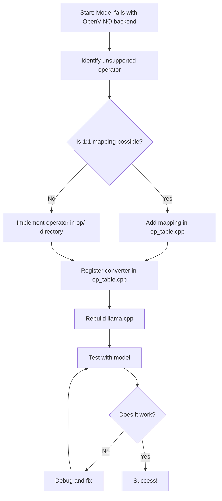

# How to Add OpenVINO Support to Unsupported Ops when using LLamacpp with openvino backend.

##  Introduction

This guide covers the steps to add support for operations that are currently unsupported when using the OpenVINO. By following these steps, you can extend OpenVINO to support additional llamacpp operations.

## Prerequisites

-   Knowledge of Python and C++ programming
-   Familiarity with llama.cpp and OpenVINO.
-   OpenVINO source code downloaded locally for modification.

Here’s a README template for enabling new operators in llama.cpp’s OpenVINO backend, including a step-by-step guide and a Mermaid diagram for the workflow.

---

# Enabling New Operators in llama.cpp OpenVINO Backend

## Introduction

This guide explains how to add support for new operators in llama.cpp’s OpenVINO backend. You can either map an operator 1:1 to an existing OpenVINO implementation or implement the operator from scratch if it is not available.

## Prerequisites

- Familiarity with C++ and OpenVINO
- llama.cpp and OpenVINO source code checked out locally

---

## Step-by-Step Workflow

### 1. Identify Unsupported Operators

- Run your model with the OpenVINO backend.
- Check logs or debug output for unsupported operator errors.


### 2. Check for 1:1 Mapping (Direct OpenVINO Operator)

- Open `ggml-openvino/openvino/op_table.cpp`.
- See if the operator exists in OpenVINO and can be mapped directly (e.g., Add, Multiply, Subtract, Divide).
- If yes, use the generic translation function `translate_1to1_match_2_inputs`:
  ```cpp
  {"GGML_OP_ADD", op::translate_1to1_match_2_inputs<v1::Add>}
  {"GGML_OP_MUL", op::translate_1to1_match_2_inputs<v1::Multiply>}
  {"GGML_OP_SUB", op::translate_1to1_match_2_inputs<v1::Subtract>}
  ```
- This function automatically maps the operator to its OpenVINO equivalent, handling two inputs and returning the corresponding node.
- If the operator is already implemented in OpenVINO, you only need to register it here using the generic function.

#### What is `translate_1to1_match_2_inputs`?

- It is a template function that wraps an OpenVINO operator (e.g., `v1::Add`, `v1::Multiply`).
- When llama.cpp encounters the operator, it calls this function, which:
  - Takes two inputs from the graph node context.
  - Instantiates the corresponding OpenVINO operator with those inputs.
  - Returns the resulting OpenVINO node.
- This avoids writing custom translation code for simple, standard ops and ensures consistent mapping.


### 3. Implement the Operator (if not available)

- If the operator is not a direct OpenVINO match, create a new file in `ggml-openvino/openvino/op/` (e.g., `myop.cpp`).
- Implement the translation logic for the operator in this file.
- Update or create the corresponding header in `openvino/op/`.
- Refer to the official OpenVINO operator documentation for available ops and usage examples: [OpenVINO Opset Reference](https://docs.openvino.ai/2025/api/ie_python_api/_autosummary/openvino.runtime.opset10.html)
- Declare the converter in `op_table.cpp`:
  ```cpp
  OP_CONVERTER(translate_myop);
  ```
- Add the operator to the supported ops list in `op_table.cpp`.

### 4. Integrate with Decoder and Backend
- If the operator requires special handling in graph construction or execution, update:
  - `ggml-decoder.cpp` (for graph node decoding, input/output mapping, or custom logic)
  - `utils.cpp` (for tensor conversion, graph execution, or profiling)
  - `ggml-openvino.cpp` (for backend device support, dispatch, or op support checks)

### 5. Rebuild llama.cpp

- Rebuild the project to apply changes:
  ```powershell
  cmake -B build
  cmake --build build --config Release
  ```

### 6. Test the Operator

- Write a test model that uses the new operator.
- Run inference and verify correctness.

---

## Example: Adding `reshape` Operator

1. Implement logic in `openvino/op/reshape.cpp`.
2. Register in `openvino/op_table.cpp`:
   ```cpp
   {"aten.reshape.default", op::translate_reshape}
   OP_CONVERTER(translate_reshape);
   ```
3. Rebuild and test.

---

## Mermaid Diagram



---

## Conclusion

- For 1:1 mappings, register the operator in `op_table.cpp`.
- For new implementations, add logic in `op/`, register, rebuild, and test.
- Use the workflow above to systematically enable new operator support in llama.cpp’s OpenVINO backend.

---
